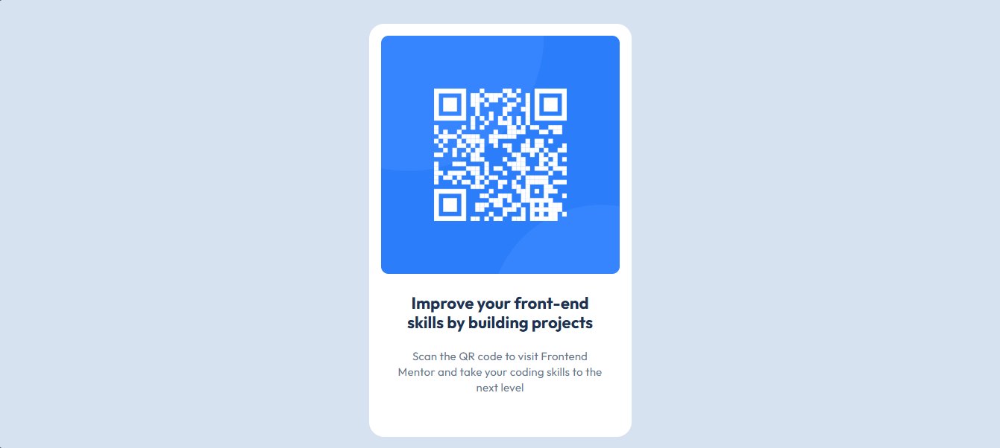

# Frontend Mentor - QR code component solution

This is a solution to the [QR code component challenge on Frontend Mentor](https://www.frontendmentor.io/challenges/qr-code-component-iux_sIO_H). Frontend Mentor challenges help you improve your coding skills by building realistic projects.

## Table of contents

- [Overview](#overview)
  - [Screenshot](#screenshot)
  - [Links](#links)
- [My process](#my-process)
  - [Built with](#built-with)
  - [What I learned](#what-i-learned)
  - [Continued development](#continued-development)
- [Author](#author)

**Note: Delete this note and update the table of contents based on what sections you keep.**

## Overview

### Screenshot

### Links

- Solution URL: [Add solution URL here](https://your-solution-url.com)
- Live Site URL: [Add live site URL here](https://your-live-site-url.com)

## My process

### Built with

- Semantic HTML5 markup
- CSS custom properties
- Flexbox

### What I learned

It has been a long time since the last time I tried to write HTML and CSS code by myself, I usually use some templates to get things done quickly.

I was so unconfident of my skills that I was so scared to start this challenge, but it was not as difficult as I initially thought. Thanks to this challenge I noticed that I can still write decent HTML and CSS code, but also that I have to practice more CSS; I think that my code can improve a lot.

Anyways, this is my first challenge and I think I did a good job. I can not wait to learn and practice more things in future challenges!

### Continued development

I want to focus on CSS to improve my skills. I still have some problems with some properties that I do no understand very well.

### Useful resources

Oops...! I forgot this section existed, so I did not save the resources I used. But I do not think it is a problem, my resources were StackOverflow and MDN, and I only used them to remember some basic concepts.

## Author

- Frontend Mentor - [@yourusername](https://www.frontendmentor.io/profile/yourusername)
